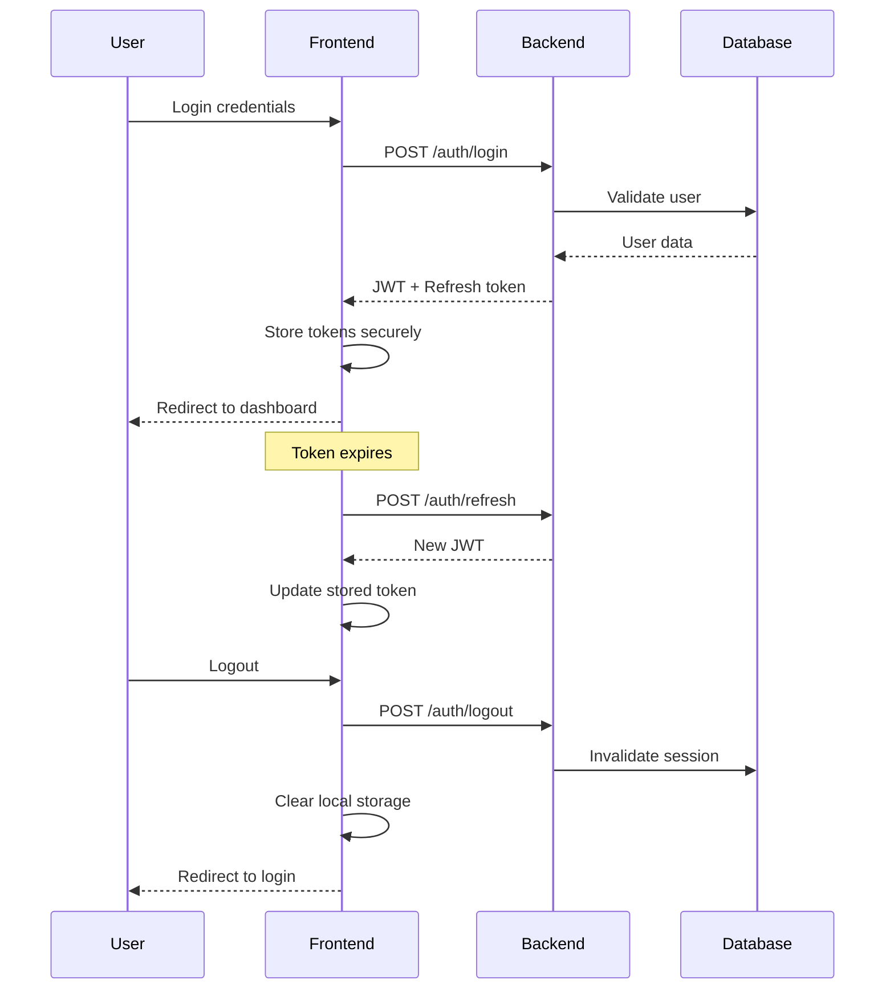

# 🏗️ ANÁLISE ARQUITETURAL - BACKEND vs FRONTEND

## 📊 **STATUS ATUAL DOS PROJETOS**

### 🚀 **BACKEND (NestJS) - Status: ✅ MADURO**

#### **Módulos Implementados:**
```
✅ AuthModule        - JWT, sessions, security completo
✅ UsersModule       - CRUD, profiles, validações  
✅ PlansModule       - Assinaturas, features (parcial)
✅ PaymentsModule    - Stripe, PayPal (parcial)
✅ CreditsModule     - Sistema de créditos (parcial)
✅ AdminModule       - Dashboard, analytics (parcial)
✅ HealthModule      - Monitoring, health checks
✅ SecurityModule    - Headers, rate limiting, CORS
```

#### **Infraestrutura Sólida:**
- ✅ TypeORM + MySQL configurado
- ✅ Redis para cache implementado
- ✅ JWT com refresh tokens
- ✅ Guards e strategies completos
- ✅ Validation pipes configurados
- ✅ Error handling centralizado
- ✅ Rate limiting multi-tier
- ✅ Logging estruturado
- ✅ Environment validation
- ✅ Docker ready

#### **APIs Disponíveis:**
```typescript
// Endpoints Auth implementados
POST   /auth/register
POST   /auth/login
POST   /auth/refresh
POST   /auth/logout
POST   /auth/forgot-password
POST   /auth/reset-password
POST   /auth/verify-email

// Endpoints Users implementados  
GET    /users/profile
PUT    /users/profile
POST   /users/change-password
GET    /users/:id (admin)
PUT    /users/:id (admin)
DELETE /users/:id (admin)
```

### 🔄 **FRONTEND (Next.js) - Status: ⚠️ REFATORAÇÃO NECESSÁRIA**

#### **O que está funcionando:**
```
✅ Landing page com tema Trezo
✅ Componentes UI básicos (Button, Input, etc.)
✅ Estrutura de pastas inicial
✅ API Service base implementado
✅ Providers de contexto básicos
✅ Layouts auth estruturados
✅ TypeScript configurado
✅ Tailwind CSS funcionando
```

#### **O que precisa refatoração:**
```
❌ Sistema auth incompleto/inconsistente
❌ Integração frontend-backend faltando
❌ Validações de formulário inadequadas
❌ Gestão de estado inconsistente
❌ Guards de rota não implementados
❌ Error handling fragmentado
❌ Falta padrões DDD
❌ Componentes não seguem design system
❌ Sem testes implementados
❌ Performance não otimizada
```

---

## 🎯 **ESTRATÉGIA DE REFATORAÇÃO**

### **Princípios Orientadores:**

#### **1. Domain-Driven Design (DDD)**
```
Organizar código por domínios de negócio:
- auth/ (autenticação e autorização)
- user/ (gestão de usuários)  
- dashboard/ (área principal)
- admin/ (administração)
- shared/ (recursos compartilhados)
```

#### **2. Separation of Concerns**
```
- presentation/ (UI, layouts, pages)
- application/ (providers, guards, middleware)
- domains/ (lógica de negócio)
- infrastructure/ (APIs, storage, monitoring)
```

#### **3. Clean Architecture**
```
Dependências fluindo de fora para dentro:
Infrastructure → Application → Domain
```

#### **4. Design Patterns**
```
- Service Layer (para lógica de negócio)
- Repository Pattern (para acesso a dados)
- Observer Pattern (para eventos)
- Factory Pattern (para criação de objetos)
- Strategy Pattern (para algoritmos intercambiáveis)
```

---

## 🔧 **IMPLEMENTAÇÃO TÉCNICA DETALHADA**

### **📁 Nova Estrutura de Pastas (DDD)**

```
src/
├── domains/                           # 🏛️ DOMÍNIOS DE NEGÓCIO
│   ├── auth/                         # Domínio: Autenticação
│   │   ├── components/               # Componentes específicos
│   │   │   ├── forms/               # Formulários
│   │   │   │   ├── LoginForm.tsx
│   │   │   │   ├── RegisterForm.tsx
│   │   │   │   ├── ForgotPasswordForm.tsx
│   │   │   │   └── ResetPasswordForm.tsx
│   │   │   ├── guards/              # Guards de proteção
│   │   │   │   ├── AuthGuard.tsx
│   │   │   │   ├── GuestGuard.tsx
│   │   │   │   └── RoleGuard.tsx
│   │   │   ├── providers/           # Social login
│   │   │   │   ├── GoogleProvider.tsx
│   │   │   │   ├── FacebookProvider.tsx
│   │   │   │   └── OAuthButton.tsx
│   │   │   └── feedback/            # Feedback visual
│   │   │       ├── AuthMessage.tsx
│   │   │       ├── LoadingState.tsx
│   │   │       └── ErrorBoundary.tsx
│   │   ├── hooks/                   # Hooks customizados
│   │   │   ├── useAuth.ts          # Hook principal
│   │   │   ├── useAuthForm.ts      # Validação de forms
│   │   │   ├── useAuthRedirect.ts  # Redirecionamentos
│   │   │   ├── useSession.ts       # Gestão de sessão
│   │   │   └── usePermissions.ts   # Controle de acesso
│   │   ├── services/                # Serviços de domínio
│   │   │   ├── auth.service.ts     # Service principal
│   │   │   ├── token.service.ts    # Gestão de tokens
│   │   │   ├── session.service.ts  # Gestão de sessões
│   │   │   ├── oauth.service.ts    # OAuth providers
│   │   │   └── security.service.ts # Funcionalidades de segurança
│   │   ├── types/                   # Tipos específicos
│   │   │   ├── auth.types.ts
│   │   │   ├── session.types.ts
│   │   │   ├── oauth.types.ts
│   │   │   └── security.types.ts
│   │   ├── utils/                   # Utilitários
│   │   │   ├── auth-utils.ts
│   │   │   ├── validation-utils.ts
│   │   │   ├── security-utils.ts
│   │   │   └── redirect-utils.ts
│   │   ├── validators/              # Validadores
│   │   │   ├── login.validator.ts
│   │   │   ├── register.validator.ts
│   │   │   ├── password.validator.ts
│   │   │   └── email.validator.ts
│   │   ├── constants/              # Constantes
│   │   │   ├── auth.constants.ts
│   │   │   ├── validation.constants.ts
│   │   │   └── routes.constants.ts
│   │   └── index.ts                # Exports públicos
│   │
│   ├── user/                        # Domínio: Usuário
│   │   ├── components/
│   │   │   ├── profile/
│   │   │   │   ├── ProfileForm.tsx
│   │   │   │   ├── AvatarUpload.tsx
│   │   │   │   └── PreferencesForm.tsx
│   │   │   └── settings/
│   │   │       ├── SecuritySettings.tsx
│   │   │       ├── NotificationSettings.tsx
│   │   │       └── PrivacySettings.tsx
│   │   ├── hooks/
│   │   │   ├── useProfile.ts
│   │   │   ├── usePreferences.ts
│   │   │   └── useUserSettings.ts
│   │   ├── services/
│   │   │   ├── user.service.ts
│   │   │   ├── profile.service.ts
│   │   │   └── preferences.service.ts
│   │   ├── types/
│   │   └── index.ts
│   │
│   ├── dashboard/                   # Domínio: Dashboard
│   │   ├── components/
│   │   │   ├── widgets/
│   │   │   ├── charts/
│   │   │   └── tables/
│   │   ├── hooks/
│   │   ├── services/
│   │   ├── types/
│   │   └── index.ts
│   │
│   ├── admin/                       # Domínio: Administração
│   │   ├── components/
│   │   │   ├── users/
│   │   │   ├── analytics/
│   │   │   └── settings/
│   │   ├── hooks/
│   │   ├── services/
│   │   ├── types/
│   │   └── index.ts
│   │
│   └── shared/                      # Recursos compartilhados
│       ├── components/              # Componentes reutilizáveis
│       │   ├── ui/                 # Sistema de design
│       │   │   ├── Button.tsx
│       │   │   ├── Input.tsx
│       │   │   ├── Modal.tsx
│       │   │   ├── Toast.tsx
│       │   │   └── LoadingSpinner.tsx
│       │   ├── layout/             # Componentes de layout
│       │   │   ├── Header.tsx
│       │   │   ├── Sidebar.tsx
│       │   │   ├── Footer.tsx
│       │   │   └── Breadcrumbs.tsx
│       │   └── forms/              # Componentes de formulário
│       │       ├── FormField.tsx
│       │       ├── ValidationMessage.tsx
│       │       └── FormWrapper.tsx
│       ├── hooks/                  # Hooks globais
│       │   ├── useLocalStorage.ts
│       │   ├── useDebounce.ts
│       │   ├── useApi.ts
│       │   └── useNotifications.ts
│       ├── utils/                  # Utilitários globais
│       │   ├── format.utils.ts
│       │   ├── date.utils.ts
│       │   ├── string.utils.ts
│       │   └── validation.utils.ts
│       ├── types/                  # Tipos globais
│       │   ├── api.types.ts
│       │   ├── common.types.ts
│       │   └── ui.types.ts
│       ├── constants/              # Constantes globais
│       │   ├── app.constants.ts
│       │   ├── api.constants.ts
│       │   └── ui.constants.ts
│       └── index.ts
│
├── infrastructure/                  # 🔧 INFRAESTRUTURA
│   ├── api/                        # Configuração de APIs
│   │   ├── client.ts              # Cliente HTTP configurado
│   │   ├── interceptors.ts        # Interceptors de req/res
│   │   ├── endpoints.ts           # Mapeamento de endpoints
│   │   └── types.ts               # Tipos da API
│   ├── storage/                    # Persistência local
│   │   ├── localStorage.ts
│   │   ├── sessionStorage.ts
│   │   ├── indexedDB.ts
│   │   └── cookies.ts
│   ├── notifications/              # Sistema de notificações
│   │   ├── toast.service.ts
│   │   ├── push.service.ts
│   │   └── email.service.ts
│   ├── monitoring/                 # Logs e métricas
│   │   ├── logger.service.ts
│   │   ├── analytics.service.ts
│   │   ├── error-tracking.ts
│   │   └── performance.service.ts
│   ├── cache/                      # Sistema de cache
│   │   ├── cache.service.ts
│   │   ├── strategies.ts
│   │   └── invalidation.ts
│   └── security/                   # Segurança
│       ├── encryption.ts
│       ├── sanitization.ts
│       └── csrf.ts
│
├── application/                     # 🎯 CAMADA DE APLICAÇÃO
│   ├── providers/                  # Context providers
│   │   ├── AppProvider.tsx        # Provider principal
│   │   ├── AuthProvider.tsx       # Provider de auth
│   │   ├── ThemeProvider.tsx      # Provider de tema
│   │   ├── I18nProvider.tsx       # Provider de i18n
│   │   └── NotificationProvider.tsx
│   ├── guards/                     # Guards de rota
│   │   ├── RouteGuard.tsx
│   │   ├── PermissionGuard.tsx
│   │   └── MaintenanceGuard.tsx
│   ├── middleware/                 # Middlewares
│   │   ├── auth.middleware.ts
│   │   ├── logging.middleware.ts
│   │   └── security.middleware.ts
│   ├── store/                      # Gestão de estado
│   │   ├── index.ts              # Store principal
│   │   ├── auth.store.ts         # Store de auth
│   │   ├── user.store.ts         # Store de usuário
│   │   └── ui.store.ts           # Store de UI
│   └── config/                     # Configurações
│       ├── app.config.ts
│       ├── api.config.ts
│       ├── theme.config.ts
│       └── i18n.config.ts
│
└── presentation/                    # 🎨 CAMADA DE APRESENTAÇÃO
    ├── components/                 # Componentes de página
    │   ├── pages/                 # Componentes específicos de página
    │   └── layouts/               # Layouts de aplicação
    ├── pages/                      # Páginas Next.js
    │   ├── auth/
    │   ├── dashboard/
    │   ├── admin/
    │   └── api/
    ├── styles/                     # Estilos globais
    │   ├── globals.css
    │   ├── components.css
    │   └── themes/
    └── assets/                     # Assets estáticos
        ├── images/
        ├── icons/
        └── fonts/
```

---

## 🔗 **INTEGRAÇÃO FRONTEND-BACKEND**

### **Service Layer Architecture:**

```typescript
// domains/auth/services/auth.service.ts
export class AuthService extends ApiService {
  constructor() {
    super('/auth'); // Base URL do backend
  }

  // 🔄 Métodos que conectam com backend NestJS
  async login(credentials: LoginRequest): Promise<AuthResponse> {
    const response = await this.post<AuthResponseDto>('/login', credentials);
    
    if (response.success) {
      // Salvar tokens e dados do usuário
      this.tokenService.setTokens(response.data.tokens);
      this.sessionService.createSession(response.data.user);
      
      return {
        success: true,
        user: response.data.user,
        tokens: response.data.tokens
      };
    }
    
    throw new Error(response.message);
  }

  async register(userData: RegisterRequest): Promise<AuthResponse> {
    // Limpar cache relacionado antes de registrar
    this.clearCacheByPattern('/auth');
    
    const response = await this.post<AuthResponseDto>('/register', userData);
    
    if (response.success) {
      return {
        success: true,
        user: response.data.user,
        message: 'Usuário criado com sucesso. Verifique seu email.'
      };
    }
    
    throw new Error(response.message);
  }

  async refreshToken(): Promise<TokenResponse> {
    const refreshToken = this.tokenService.getRefreshToken();
    
    if (!refreshToken) {
      throw new Error('No refresh token available');
    }

    const response = await this.post<TokenResponseDto>('/refresh', {
      refreshToken
    });
    
    if (response.success) {
      this.tokenService.setTokens(response.data);
      return response.data;
    }
    
    throw new Error('Failed to refresh token');
  }

  async logout(): Promise<void> {
    try {
      await this.post('/logout');
    } catch (error) {
      console.error('Logout error:', error);
    } finally {
      // Limpar dados locais independente do resultado
      this.tokenService.clearTokens();
      this.sessionService.clearSession();
      this.clearCache();
    }
  }
}
```

### **Hook Integration:**

```typescript
// domains/auth/hooks/useAuth.ts
export function useAuth() {
  const authStore = useAuthStore();
  const router = useRouter();
  
  const login = useCallback(async (credentials: LoginRequest) => {
    try {
      authStore.setLoading(true);
      authStore.clearError();
      
      const result = await authService.login(credentials);
      
      authStore.setUser(result.user);
      authStore.setAuthenticated(true);
      
      // Redirecionamento inteligente
      const returnUrl = sessionStorage.getItem('returnUrl') || '/dashboard';
      sessionStorage.removeItem('returnUrl');
      router.push(returnUrl);
      
    } catch (error) {
      authStore.setError(error.message);
    } finally {
      authStore.setLoading(false);
    }
  }, [authStore, router]);

  const logout = useCallback(async () => {
    try {
      authStore.setLoading(true);
      await authService.logout();
      
      authStore.reset();
      router.push('/auth/login');
      
    } catch (error) {
      console.error('Logout error:', error);
      // Limpar estado local mesmo se o logout remoto falhar
      authStore.reset();
      router.push('/auth/login');
    } finally {
      authStore.setLoading(false);
    }
  }, [authStore, router]);

  return {
    // Estado
    user: authStore.user,
    isAuthenticated: authStore.isAuthenticated,
    isLoading: authStore.isLoading,
    error: authStore.error,
    
    // Ações
    login,
    logout,
    register: authStore.register,
    refreshUser: authStore.refreshUser,
    
    // Utilitários
    hasRole: (role: UserRole) => authStore.user?.role === role,
    hasPermission: (permission: string) => 
      authStore.user?.permissions?.includes(permission) ?? false,
    clearError: authStore.clearError,
  };
}
```

---

## 🛡️ **SEGURANÇA E BOAS PRÁTICAS**

### **Authentication Flow:**



### **Security Implementations:**

#### **1. Token Management:**
```typescript
// infrastructure/storage/token.service.ts
export class TokenService {
  private readonly ACCESS_TOKEN_KEY = 'access_token';
  private readonly REFRESH_TOKEN_KEY = 'refresh_token';
  
  setTokens(tokens: TokenPair): void {
    // Armazenar de forma segura (httpOnly cookies em produção)
    this.secureStorage.setItem(this.ACCESS_TOKEN_KEY, tokens.accessToken);
    this.secureStorage.setItem(this.REFRESH_TOKEN_KEY, tokens.refreshToken);
  }
  
  getAccessToken(): string | null {
    return this.secureStorage.getItem(this.ACCESS_TOKEN_KEY);
  }
  
  getRefreshToken(): string | null {
    return this.secureStorage.getItem(this.REFRESH_TOKEN_KEY);
  }
  
  clearTokens(): void {
    this.secureStorage.removeItem(this.ACCESS_TOKEN_KEY);
    this.secureStorage.removeItem(this.REFRESH_TOKEN_KEY);
  }
  
  isTokenExpired(token: string): boolean {
    try {
      const decoded = jwt.decode(token) as any;
      return decoded.exp * 1000 < Date.now();
    } catch {
      return true;
    }
  }
}
```

#### **2. Route Protection:**
```typescript
// domains/auth/components/guards/AuthGuard.tsx
export function AuthGuard({
  children,
  requireAuth = true,
  requiredRoles = [],
  requireEmailVerification = false,
  fallback = <AuthFallback />,
  redirectTo = '/auth/login'
}: AuthGuardProps) {
  const { user, isAuthenticated, isLoading } = useAuth();
  const router = useRouter();
  const pathname = usePathname();

  useEffect(() => {
    if (isLoading) return;

    // Salvar URL de retorno
    if (requireAuth && !isAuthenticated) {
      sessionStorage.setItem('returnUrl', pathname);
      router.push(redirectTo);
      return;
    }

    // Verificar se email foi verificado
    if (requireEmailVerification && user && !user.isEmailVerified) {
      router.push('/auth/verify-email');
      return;
    }

    // Verificar roles necessários
    if (requiredRoles.length > 0 && user) {
      const hasRequiredRole = requiredRoles.some(role => 
        user.roles?.includes(role)
      );
      
      if (!hasRequiredRole) {
        router.push('/unauthorized');
        return;
      }
    }

    // Redirecionar usuários autenticados de páginas de guest
    if (!requireAuth && isAuthenticated) {
      router.push('/dashboard');
      return;
    }
  }, [isAuthenticated, isLoading, user, pathname]);

  if (isLoading) {
    return fallback;
  }

  if (requireAuth && !isAuthenticated) {
    return null;
  }

  if (requireEmailVerification && user && !user.isEmailVerified) {
    return null;
  }

  if (requiredRoles.length > 0 && user) {
    const hasRequiredRole = requiredRoles.some(role => 
      user.roles?.includes(role)
    );
    
    if (!hasRequiredRole) {
      return null;
    }
  }

  return <>{children}</>;
}
```

---

## 📈 **PRÓXIMOS PASSOS PRIORITÁRIOS**

### **🚀 SPRINT 1 - Fundação (Semana 1-2)**

#### **Day 1-3: Estrutura DDD**
1. ✅ Criar nova estrutura de pastas DDD
2. ✅ Migrar componentes existentes para domínios
3. ✅ Configurar barrel exports (index.ts)
4. ✅ Atualizar todos os imports

#### **Day 4-7: Core Services**
1. ✅ Refatorar AuthService herdando ApiService
2. ✅ Implementar TokenService
3. ✅ Criar SessionService
4. ✅ Setup da integração com backend

#### **Day 8-10: Guards e Providers**
1. ✅ Implementar AuthGuard completo
2. ✅ Refatorar AuthProvider
3. ✅ Criar guards de role e permissão
4. ✅ Setup de middleware de rota

### **🔧 SPRINT 2 - Auth Implementation (Semana 3-4)**

#### **Day 11-14: Forms e Validação**
1. ✅ Refatorar LoginForm com validação robusta
2. ✅ Implementar RegisterForm
3. ✅ Criar ForgotPasswordForm
4. ✅ Implementar ResetPasswordForm

#### **Day 15-18: Features Avançadas**
1. ✅ Implementar Social Login (Google, Facebook)
2. ✅ Criar sistema de notificações
3. ✅ Implementar remember me
4. ✅ Adicionar multi-language support

#### **Day 19-20: Testing e Polish**
1. ✅ Criar testes unitários
2. ✅ Testes de integração com backend
3. ✅ Refinamentos de UX
4. ✅ Performance optimizations

---

## 📊 **MÉTRICAS DE SUCESSO**

### **Técnicas:**
- ✅ Coverage de testes > 80%
- ✅ Performance score > 90
- ✅ Bundle size < 500KB inicial
- ✅ First Contentful Paint < 1.5s
- ✅ Zero vulnerabilidades críticas

### **Funcionais:**
- ✅ Login/logout funcionando
- ✅ Registro com validação
- ✅ Recuperação de senha
- ✅ Social login
- ✅ Guards de rota
- ✅ Sessão persistente

### **UX:**
- ✅ Interface responsiva
- ✅ Acessibilidade WCAG 2.1 AA
- ✅ Feedback visual claro
- ✅ Tempos de resposta < 2s
- ✅ Navegação intuitiva

---

*📊 Análise realizada em: 22/07/2025*  
*🎯 Prioridade: Alta - Refatoração crítica para qualidade do produto*  
*⚡ Status: Pronto para execução imediata*
